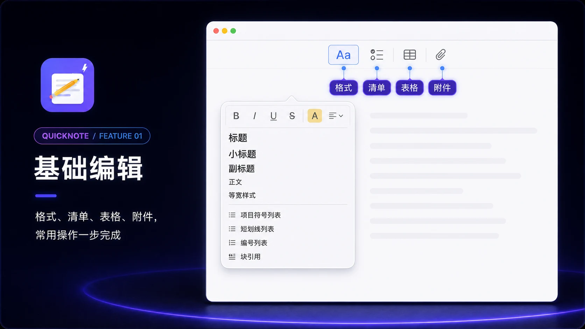
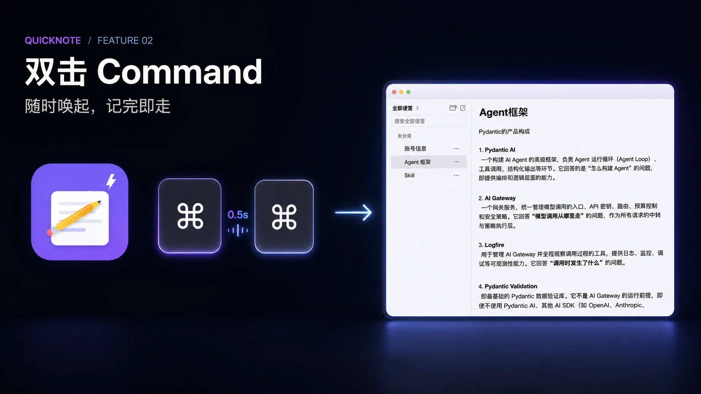
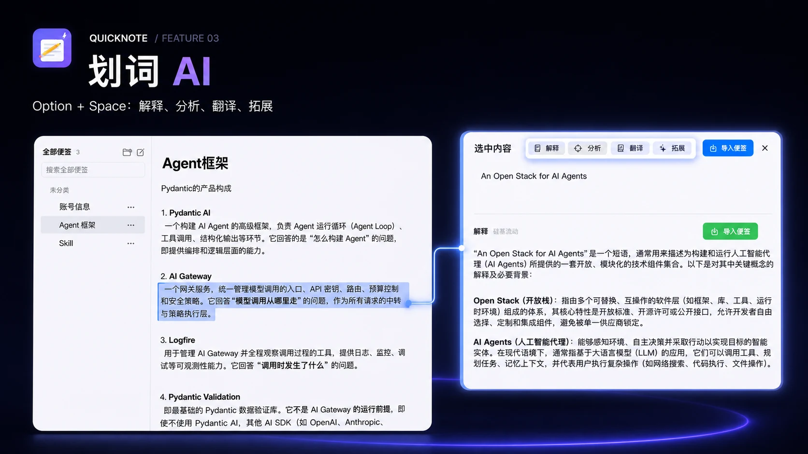
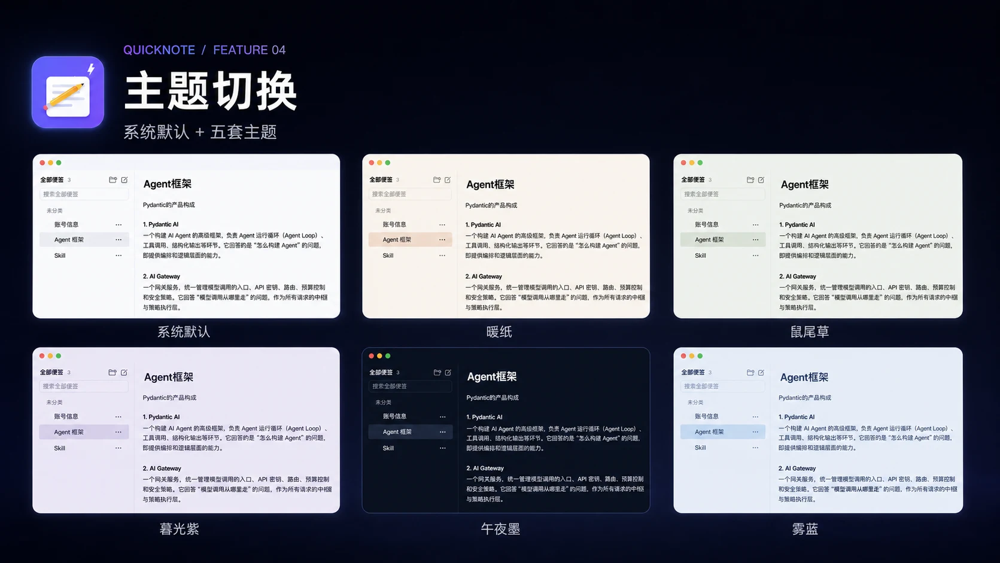

# QuickNote

QuickNote 是一款本地优先的 macOS 便签工具。双击 Command 即刻唤起，记录完成后回到原来的工作流；选中文字后按 Option + Space，或按 Command + Shift 截取屏幕区域，可以直接调用 AI 分析并把结果导入便签。

## 功能演示

### 1. 基础编辑

顶部工具栏集中提供格式、清单、表格与附件四项常用操作。格式面板支持标题层级、粗体、斜体、下划线、删除线、颜色、对齐与列表样式。



### 2. 双击 Command

无需切换应用或寻找窗口。连续按两次 Command，QuickNote 立即出现；再次双击即可收起，回到刚才的工作。



### 3. 划词 AI

在任意支持文字选择的 App 中选中文字，按 Option + Space 调用解释、分析、翻译或拓展。结果可保留结构，一键导入便签。



### 4. 截图识图 AI

按 Command + Shift 选择屏幕区域，QuickNote 会将截图交给图片模型。可以总结要点、提取原文、翻译中文、整理表格、生成待办或排查问题，截图和分析结果均可导入便签。

### 5. 主题切换

除系统默认外，还提供暖纸、鼠尾草、暮光紫、午夜墨与雾蓝五套主题。主题只改变阅读环境，不改变笔记内容。



## 功能

- 双击 Command 快速打开或收起便签
- 第一行默认作为大号标题，正文统一使用系统 13pt 字体
- 文件夹分类、搜索、固定与侧边快速切换
- 富文本、清单、表格、链接、图片、文件和音频附件
- Command + Z 逐步撤销文字与格式操作
- 五套主题配色
- 选中文字后调用 AI，并将结构化结果保留格式导入
- Command + Shift 截图识图，支持六种常用分析场景
- 最多保存 6 个 API 接入，按文字或图片任务自动路由模型
- RTFD 本地持久化，API Key 存入 macOS 钥匙串

## 环境

- macOS 14+
- Xcode
- [XcodeGen](https://github.com/yonaskolb/XcodeGen)

## 构建

```bash
brew install xcodegen
./scripts/verify-p0.sh
open /tmp/QuickNoteDerived/Build/Products/Release/QuickNote.app
```

首次使用快捷键时，请按应用内说明开启“输入监控”和“辅助功能”权限。

## 数据与隐私

便签保存在本机 `~/Library/Application Support/QuickNote/`。基础记录功能不依赖 AI；只有用户主动调用 AI 功能时，所选内容才会发送到用户配置的模型服务。
