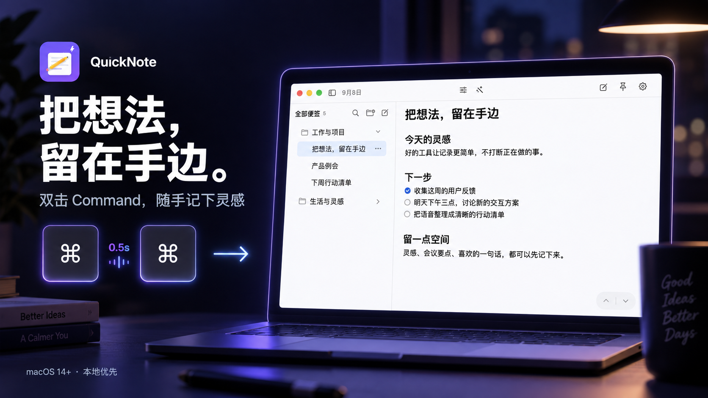
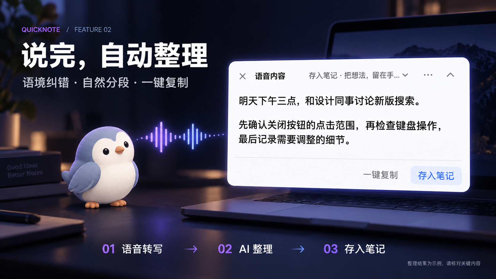
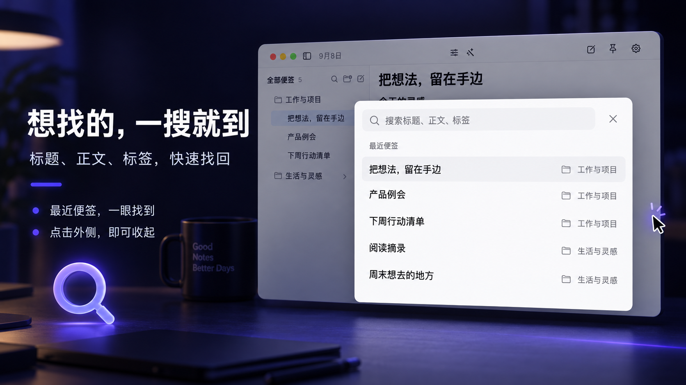
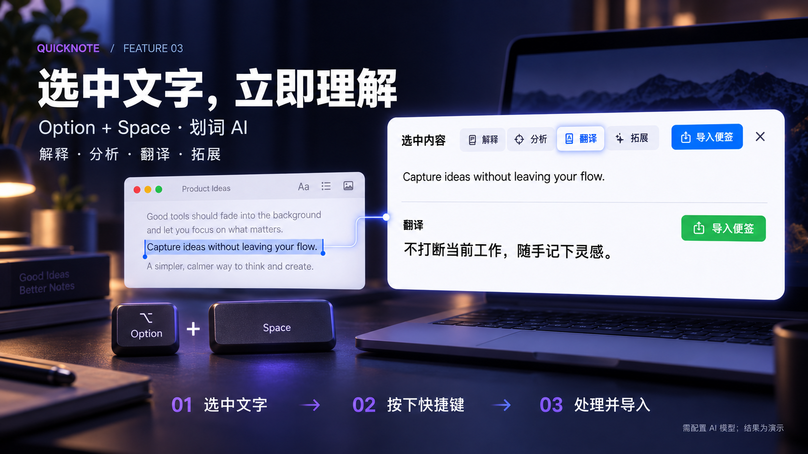

# QuickNote-IOS

### 把想法，留在手边。

QuickNote 是一款本地优先的 macOS 便签工具。双击 Command 随手记下灵感，用 Option + Space 理解选中文字，用 Command + Shift 框选屏幕识图取字。小鸟 Pip 接住语音和文件，让零散内容回到清晰的笔记里。

> 当前支持 **macOS 14+**。仓库名为 `QuickNote-IOS`，尚未提供 iPhone / iPad 版本。



*以下为基于新版界面与演示数据设计的功能介绍图，并非未经处理的截图；语音整理结果为示例，不代表识别准确率。*

## 随手记，也能认真整理

双击 Command 打开或收起便签，记完继续手头的工作。正文采用系统字体和标准段落间距，支持标题、清单、表格、链接、图片与文件附件；需要的时候，也能用 Command + Z 撤销文字和格式操作。

文件夹负责分类，右下角的上一条 / 下一条按钮负责快速翻阅，不再占用顶部工具栏。也可使用 Command + Option + 左右方向键切换。

## 认识 Pip，你的桌面小鸟


Pip 不只是陪伴：悬停可以打开快捷入口，拖入文件可以收集内容，录音、识别和导入时会用气泡提示当前状态。支持拖动位置、调整大小和朝向，也保留日常互动的小对白。

在设置最上方开启「Pip 桌宠陪伴」，让记录入口留在手边。

## 说完，自动整理

语音先在本机转写，并在离线模型可用时进行增强复核。录音结束后，已配置的 AI 模型会自动结合本次文字纠错、润色和自然分段，不需要再点一次「AI 识别」。整理后可以「一键复制」，也可以选择目标「存入笔记」。



AI 服务暂时繁忙时会有限重试；失败则保留原始转写，支持手动重试，无需重新录音。**同音词、专有名词和含糊发音仍可能需要人工确认，不能保证 100% 准确。**

## 找笔记，不打断思路

侧栏的放大镜打开紧凑搜索浮层。未输入时查看最近便签，输入后搜索标题、正文和标签；结果同时显示所属文件夹。支持键盘操作、Esc 关闭，也可以点击弹窗外侧关闭。



## 选中文字，立即理解

在支持文字选择的应用里选中一段内容，按 **Option + Space（⌥ + 空格）** 打开「选中内容」面板。点击解释、分析、翻译或拓展，按当前任务处理文字；原文和处理结果都可以导入便签，不需要手动复制到另一个聊天窗口。



例如：阅读英文资料时选中一句话，按快捷键后点击「翻译」，再把译文存入笔记。处理前需配置文字模型；所选内容会发送至配置的服务商。

## 框选屏幕，识图取字

**同时按下 Command + Shift（⌘ + ⇧），松开两键后框选屏幕区域**，打开「图片识别」面板。不需要再按数字键。


点「提取原文」识别图片里的文字，或选择总结要点、翻译中文、整理表格、生成待办、排查问题；也可以直接输入问题。截图和分析结果分别支持「导入图片」「导入分析」，方便收下原始资料与整理结果。

适合不能直接选中文字的图片、截图和扫描资料。首次使用需授予屏幕录制权限，并配置支持图片的模型；所选截图会发送至配置的服务商。

## 模型与阅读设置

- **自选模型**：最多保存 6 个 API 接入，文字和图片任务分别选择模型；备用服务转发由你控制。
- **阅读主题**：系统默认之外，提供暖纸、鼠尾草、暮光紫、午夜墨与雾蓝五套配色。

## 本地优先，数据去向明确

便签以 RTFD 保存在本机 `~/Library/Application Support/QuickNote/`，API Key 存入 macOS 钥匙串。基础记录不依赖 AI 服务。

调用 AI 时会将所选内容发送到你配置的服务商；语音自动整理发送本次转写文字，**不发送录音或整个便签库**。无法访问的旧钥匙串条目会保留，不改动系统密码。请勿将不希望外发的敏感内容交给云端 AI。

## 构建与运行

需要 macOS 14+、Xcode 和 [XcodeGen](https://github.com/yonaskolb/XcodeGen)。语音模型不放入 Git；验证脚本会从官方发布下载并校验模型，首次约 230 MB。

```bash
brew install xcodegen
export QUICKNOTE_SIGNING_IDENTITY='Apple Development: YOUR_NAME (CERTIFICATE_ID)'
export QUICKNOTE_DEVELOPMENT_TEAM='YOUR_TEAM_ID'
./scripts/verify-p0.sh
open /tmp/QuickNoteDerived/Build/Products/Release/QuickNote.app
```

首次使用快捷键时，请按应用内说明开启「输入监控」和「辅助功能」权限。

将签名占位值替换为本人的有效证书与团队标识，并在后续更新中保持签名身份稳定。验证脚本不会在证书不可用时回退到临时签名。仅本地调试可使用工程默认临时签名，但不要用它覆盖保存过密钥的正式安装。仓库不包含维护者个人签名配置。离线模型与原生运行时的许可证保留在 `QuickNote/Resources/Speech/`。

界面截图可通过 `QuickNoteTests/ReadmeScreenshotTests.swift` 使用独立演示数据重新生成，不需要访问个人便签或调用 AI 服务。

最近更新见 [2026-09-08 更新说明](docs/2026-09-08-release-notes.md)。
