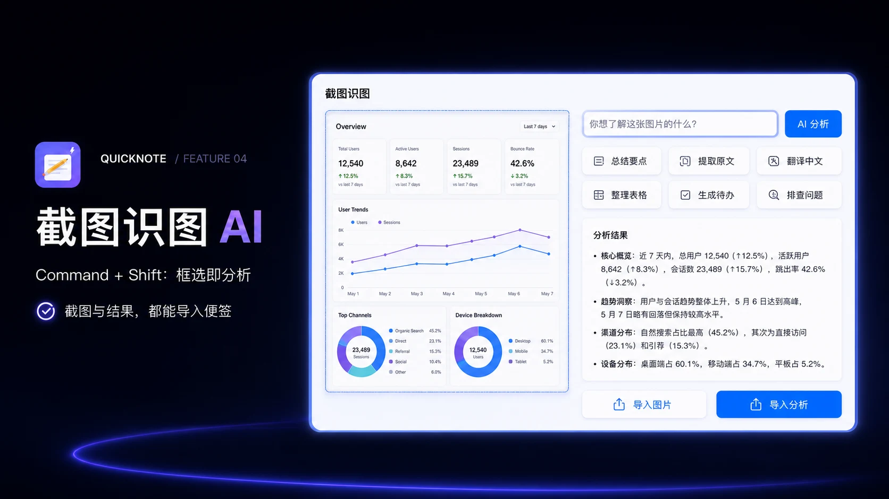

# QuickNote-IOS

> 仓库名为 `QuickNote-IOS`，当前实际实现与构建目标仍为 **macOS 14+**，尚未提供 iPhone / iPad 版本。

QuickNote 是一款本地优先的 macOS 便签工具。双击 Command 即刻唤起，记录完成后回到原来的工作流；选中文字后按 Option + Space，或按 Command + Shift 截取屏幕区域，可以直接调用 AI 分析并把结果导入便签。

## 功能演示

### 1. 基础编辑

顶部工具栏集中提供格式、清单、表格与附件四项常用操作。格式面板支持标题层级、粗体、斜体、下划线、删除线、颜色、对齐与列表样式。


### 2. 双击 Command

无需切换应用或寻找窗口。连续按两次 Command，QuickNote 立即出现；再次双击即可收起，回到刚才的工作。


### 3. 划词 AI

在任意支持文字选择的 App 中选中文字，按 Option + Space 调用解释、分析、翻译或拓展。结果可保留结构，一键导入便签。


### 4. 截图识图 AI

按 Command + Shift 选择屏幕区域，QuickNote 会将截图交给图片模型。可以总结要点、提取原文、翻译中文、整理表格、生成待办或排查问题，截图和分析结果均可导入便签。



### 5. 主题切换

除系统默认外，还提供暖纸、鼠尾草、暮光紫、午夜墨与雾蓝五套主题。主题只改变阅读环境，不改变笔记内容。


## 功能

- Pip 小鸟桌宠：拖动、缩放、左右朝向、状态气泡、悬停快捷入口与文件拖入
- 本机语音输入、实时转写与默认 SenseVoice 离线复核，录音结束后自动进行 AI 纠错和分段，支持一键复制与存入笔记
- AI 整理遇到 502/503/504 时最多自动重试两次，失败保留原文并支持手动重试，不需重新录音
- 紧凑搜索浮层，支持最近便签、标题/正文/标签搜索、键盘操作、Esc 和点击外侧关闭
- 右下角常驻翻页按钮，支持完整点击区域和窗口未激活时直接首击；保留 Command + Option + 左右方向键
- 选中文字后点击翻译、解释、分析或拓展即可处理，不再弹重复的发送确认
- 钥匙串读取失败时提供明确提示及单接入安全重新配置，不覆盖旧密钥库
- 双击 Command 快速打开或收起便签
- 第一行默认作为大号标题，正文统一使用系统 13pt 字体
- 正文使用常规字重和标准段落间距，保留已有标题、附件与手动格式
- 文件夹分类、搜索、固定与侧边快速切换
- 富文本、清单、表格、链接、图片、文件和音频附件
- Command + Z 逐步撤销文字与格式操作
- 五套主题配色
- 选中文字后调用 AI，并将结构化结果保留格式导入
- Command + Shift 截图识图，支持六种常用分析场景
- 最多保存 6 个 API 接入，按文字或图片任务自动路由模型
- RTFD 本地持久化，API Key 存入 macOS 钥匙串

## 环境

- macOS 14+
- Xcode
- [XcodeGen](https://github.com/yonaskolb/XcodeGen)

## 构建

语音模型不放入 Git。验证脚本会先从官方发布下载并校验模型（首次约 230 MB），再生成 Xcode 工程。

```bash
brew install xcodegen
export QUICKNOTE_SIGNING_IDENTITY='Apple Development: YOUR_NAME (CERTIFICATE_ID)'
export QUICKNOTE_DEVELOPMENT_TEAM='YOUR_TEAM_ID'
./scripts/verify-p0.sh
open /tmp/QuickNoteDerived/Build/Products/Release/QuickNote.app
```

首次使用快捷键时，请按应用内说明开启“输入监控”和“辅助功能”权限。

将签名占位值替换为本人的有效证书与团队标识，并在后续更新中保持签名身份稳定。验证脚本不再将发布包重新签成临时身份，也不会在证书不可用时回退到临时签名。仅本地调试可直接使用工程默认临时签名，但不要用它覆盖保存过密钥的正式安装。仓库不包含维护者个人签名配置。离线模型与原生运行时的许可证保留在 `QuickNote/Resources/Speech/`。

## 数据与隐私

便签保存在本机 `~/Library/Application Support/QuickNote/`。基础记录功能不依赖 AI；用户调用 AI 时会发送所选内容，语音输入结束后自动整理会发送本次转写文字到已配置的模型服务，不发送录音或整个便签库。无法访问的旧钥匙串条目会保留，不自动弹出重复授权，也不改动系统密码。

最近更新见 [2026-09-08 更新说明](docs/2026-09-08-release-notes.md)。
